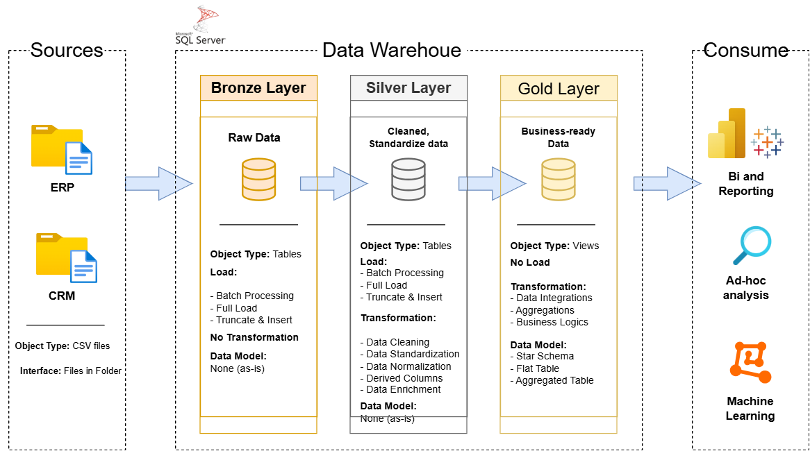

# **Data Warehouse & Analytics Project**

This repository presents a complete, production-style **Data Warehouse and Analytics solution** developed using SQL Server. It follows modern data engineering principles, including structured data architecture, SQL-based ETL pipelines, data modeling, and analytical reporting.

---

## **1. Project Overview**

This project demonstrates the full lifecycle of building a data warehouse using a multi-layered architecture. It integrates data from multiple source systems, applies quality and transformation standards, and prepares business-ready data for analytics.

The solution is designed to illustrate practical skills required in:

* Data Engineering
* Data Warehouse Development
* ETL Pipeline Development
* SQL Development
* Data Analytics

---

## **2. Architecture Overview**

This project implements the **Medallion Architecture**, a layered approach used in modern data platforms to ensure data quality, maintainability, and scalability.



### **Bronze Layer – Raw Data**

* Stores data exactly as received from source systems
* CSV files from ERP and CRM systems are loaded into SQL Server
* No transformations applied

### **Silver Layer – Cleaned & Standardized Data**

* Applies data quality rules
* Handles formatting, deduplication, and normalization
* Ensures consistent, analysis-ready datasets

### **Gold Layer – Business-Ready Data**

* Modeled using the **Star Schema**
* Contains fact and dimension tables optimized for analytical queries
* Supports reporting and business intelligence use cases

---

## **3. Tech Stack & Tools**

All tools used in this project are free.

**Core Technologies**

* [SQL Server Express](https://www.microsoft.com/en-us/sql-server/sql-server-downloads)
* [SQL Server Management Studio (SSMS)](https://learn.microsoft.com/sql/ssms)
* CSV files – Source datasets (ERP & CRM)

**Documentation & Design**

* DrawIO – Architecture, model, and data flow diagrams
* Notion – Project planning documentation
* GitHub – Version control

**Useful Links**

* Project datasets → `/datasets/`
* SQL Server Express → Microsoft Download
* SSMS → Microsoft Download
* Notion template and project steps → See project documentation

---

## **4. Project Requirements**

### **A. Data Engineering – Data Warehouse Development**

**Objective**
Develop a scalable data warehouse integrating ERP and CRM sales datasets to support analysis and reporting.

**Deliverables**

* Import and store raw CSV data in SQL Server
* Clean, transform, and validate data
* Integrate datasets from both source systems
* Build fact and dimension tables following best modeling practices
* Provide complete documentation, including metadata and architecture

**Scope**

* Latest snapshot of data only (no historization)
* Clear documentation for analysts, engineers, and stakeholders

---

### **B. Data Analytics – Insights & Reporting**

**Objective**
Build SQL-based analytical outputs to provide insights across:

* Customer behavior
* Product performance
* Sales patterns and trends

Refer to:
`docs/requirements.md` for the full analytics specification.

---

## **5. Repository Structure**

```
data-warehouse-project/
│
├── datasets/                           # Source datasets (ERP & CRM in CSV format)
│
├── docs/                               # Documentation and architectural assets
│   ├── data_architecture.drawio        # Architecture diagram
│   ├── data_flow.drawio                # ETL flow diagram
│   ├── data_models.drawio              # Star schema model
│   ├── etl.drawio                      # ETL techniques and framework
│   ├── data_catalog.md                 # Data dictionary and metadata
│   ├── naming-conventions.md           # Standard naming rules
│
├── scripts/                            # SQL scripts for ETL and modeling
│   ├── bronze/                         # Raw data loading
│   ├── silver/                         # Data cleaning & transformation
│   ├── gold/                           # Fact and dimension modeling
│
├── tests/                              # Data quality tests & validation
│
├── README.md                           # Project documentation
├── LICENSE                             # License information
├── .gitignore                          # Git ignore settings
└── requirements.txt                    # Project dependencies
```

---

## **6. How to Run the Project**

1. Install **SQL Server Express** and **SSMS**
2. Clone the repository
3. Load source files from `/datasets/` into SQL Server
4. Execute SQL scripts in order:

   * `scripts/bronze/`
   * `scripts/silver/`
   * `scripts/gold/`
---

## **7. Key Features**

* Full Medallion Architecture (Bronze → Silver → Gold)
* SQL-based ETL without external tools
* Enterprise-style documentation and metadata
* Star schema modeling for efficient analytics
* Clean, maintainable repository structure
* Reproducible setup for students and professionals

---

## **8. License**

This project is licensed under the **MIT License**.
You are free to use, modify, and distribute this project with proper attribution.

---
## **9. About the Author**

Hi there! I'm **SilMeta Seng**.  
I’m a Data Science & AI Engineering student committed to sharing the projects I complete and helping others learn through practical examples.

### **Connect With Me**

* **LinkedIn:** https://www.linkedin.com/in/meta-seng


---
